<style type="text/css">
.title-slide {
  background-color: #EDEDED; 
}
article p {
  text-align:left;
}
p {
  text-align:left;
}
img {     
  max-width: 90%
}
</style>

<script type="text/javascript" src="http://ajax.aspnetcdn.com/ajax/jQuery/jquery-1.7.min.js"></script>
<script type="text/javascript">
$(function() {     
  $("p:has(img)").addClass('centered'); 
  });
</script>
 
## Purpose of This Course

You should leave here today:

* Having some basic familiarity with key terms,
* Having used a few standard fundamental methods, and have a grounding in the underlying theory,
* Having developed some familiarity with the python package `scikit-learn`
* Understanding some basic concepts with broad applicability.

We'll cover, and you'll use, most or all of the following methods:

|                |  Supervised   |  Unsupervised|
|---------------:|:--------------|:---------------|
|  CONTINUOUS    |  **Regression**:  OLS, Lowess, Lasso |   **Variable Selection**: PCA |
|  DISCRETE      |  **Classification**:  Logistic Regression, kNN, Decision Trees, Naive Bayes, Random Forest |   **Clustering**: k-Means, Hierarchical Clustering |

--- &twocol

## Techniques, Concepts

... but more importantly, we'll look in some depth at these concepts:

*** =left

* Bias-Variance
* Resampling methods
    * Bootstrapping
    * Cross-Validation
    * Permutation tests

*** =right

* Model Selection
* Variable Selection
* Multiple Hypothesis Testing
* Geometric Methods
* Tree-based Methods
* Probabilistic methods

---

## ML and Scientific Data Analysis

Machine Learning is in some ways very similar to day-to-day scientific data analysis:

* Machine learning is model fitting.
* First, data has to be:
    * put into appropriate format for tools,
    * quickly summarized/visualized as sanity check ("data exploration"),
    * cleaned
* Then some model is fit and parameters extracted.
* Conclusions are drawn.

---

## ML vs Scientific Data Analysis

Many scientific problems being analyzed are already very well characterized.

* Model already defined, typically very solidily;
* Estimating a small number of parameters within that framework.

Machine learning is model fitting...

* But the model may be implicit,
* ... and disposable.
* The model exists to explore the data, or make improved predictions.
* Generally not holding out for some foundational insight into the fundamental nature of our world.

---

## Scientific Data Analysis with ML

But ML approaches can be very useful for science, particularly at the beginning of a research programme:

* Exploring data;
* Uncovering patterns;
* Testing models.

Having said that, there are some potential gotchas:

* Different approaches, techniques than common in scientific data analysis.  Takes some people-learning.
* When not just parameters but the model itself up for grabs, one has to take care not to lead oneself astray.
    * Getting "a good fit" is not in question when you have all possible models devised by human minds at your disposal.  But does it mean anything?

---

## Types of problems

Broadly, data analysis problems fall into two categories:

* **Supervised**: already have some data labelled with (approximately) the right answer.
    * *e.g.*, curve fitting
    * For prediction.  "Train" the model on known data, predict on new unlabelled data.
* **Unsupervised**: discover patterns in data.
    * What groups of items in this data are similar?  Different?
    * For exploration, evaluation, and prediction if useful.

---

## Types of Data

And we will be working on two broad classes of variables:

* **Continuous**: real numbers.
* **Discrete**: 
     * Binary: True/False, On/Off.
     * Categorical: Item falls into category A, category B...
     * Ordinal: Discrete, but has an intrinsic order.  (Low, Med, High; S, M, L, XL).

Others are possible too -- intervals, temporal or spatial continuous data -- but we won't be considering those today.

--- .segue .dark

## Regression

---

## Regression

We're going to spend this morning discussing regression.

* It's the most familiar to most of us; so
* It's a good place to introduce some concepts we'll find useful through the rest of the day.

In regression problems, 

* Data comes in as a set of $n$ observations.
* Each of which has $p$ "features"; we'll be considering all-continuous input features, which isn't necessarily the case.
* And the initial data we have also has a known "endogenous" value, the $y$-value we're trying to fit.
* Goal is to learn a function $y = \hat{f}(x_1, x_2, \dots, x_p)$ for predicting new values.

---

## Ordinary Least Squares (OLS)

As we learned on our grandmothers knee, a good way to fit a functional
form $\hat{y} = \hat{f}(\vec{x};\theta)$ to some data $(\vec{x},y)$
is to minimize the squared error.  We assume the data is generated
by some true function

$$
y = f(\vec{x}) + \epsilon
$$

where $\epsilon$ is some irreducible error (here assumed constant), and we choose $\theta$:

$$
\hat{\theta} = \mathrm{argmin}_\theta \sum_i \left ( y_i - \hat{f} (x_i, \theta) \right )^2.
$$

---

## Note on Loss Functions

Here we're going to be using least squares error as the function
to minimize.  But this is not the only *loss* *function* one could
usefully optimize.

In particular, least-squares has a number of very nice mathematical
properties, but it puts a lot of weight on outliers.  If the residual
$r_i = y_i - \hat{y}_i$ and the loss function is $l = \sum_i
\rho(r_i)$, some "robust regression" methods use different methods:

$$ 
\begin{eqnarray*} 
\rho_\mathrm{LS}(r_i) & = &  r_i^2 \\
\rho_\mathrm{Huber}(r_i) & = & \left \{ \begin{array}{ll} r_i^2 & \mathrm{if } |r_i| \le c; \\ c(2 r_i - c) & \mathrm{if } |r_i| > c. \\ \end{array} \right . \\
\rho_\mathrm{Tukey}(r_i) & = & \left \{ \begin{array}{ll} r_i \left ( 1 - \frac{r_i}{c} \right )^2 & \mathrm{if } |r_i| \le c; \\ 0 & \mathrm{if } |r_i| > c. \\ \end{array} \right . \\
\end{eqnarray*} 
$$

---

## Note on Loss Functions

Even crazier loss functions are possible --- for your particular
application, it may be worse to over-predict than under-predict
(for instance), so the loss function needn't necessarily be symmetric
around $r_i = 0$.

The "right" loss function is problem-dependent.

For now, we'll just use least-squares, as it's familar and the
mechanics don't change with other loss functions.  However, different
algorithms may need to be used to use different loss functions;
many explicitly use the nice mathematical properties of least
squares.

---

## Polynomial Regression

Let's do some linear regression of a noisy, tilted sinusoid:


```python
import scripts.regression.biasvariance as bv
import numpy
import matplotlib.pylab as plt

x,y = bv.noisyData(npts=40)
p = numpy.polyfit(x, y, 1)
fitfun = numpy.poly1d(p)

plt.plot(x,y,'ro')
plt.plot(x,fitfun(x),'g-')
plt.show()
```

--- &twocol

## Polynomial Regression

*** =left

We should have something that looks like the figure on the right.

Questions we should be asking ourselves whenever we're doing something like this:

* How is this likely to perform on new data?
* How is the accuracy likely to be in the centre ($x = 0$)?  At $x = 2$?
* How robust is our prediction - how variable is it likely to be if we had gotten different data?

*** =right

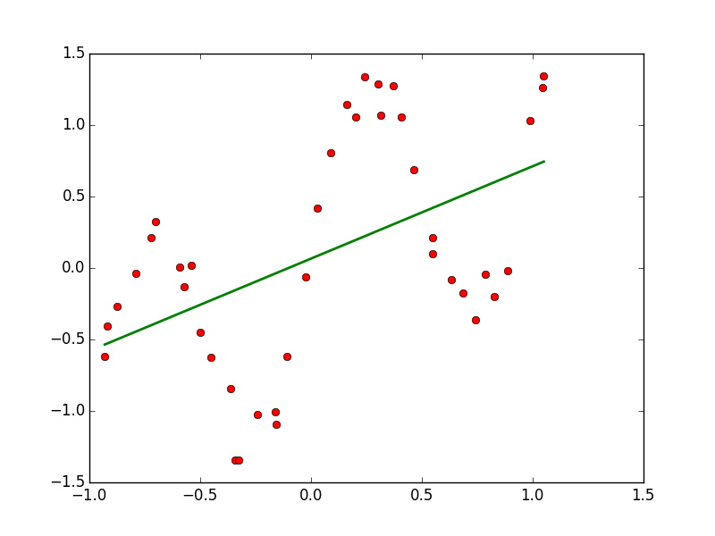

--- &twocol

## Polynomial Regression

*** =left

Repeat the same steps with degree 20. 

We can get much better accuracy at our points if we use a higher-order polynomial.

Ask ourselves the same questions:

* How is this likely to perform on new data?
* How is the accuracy likely to be in the centre ($x = 0$)?  At $x = 2$?
* How robust is our prediction - how variable is it likely to be if we had gotten different data?

*** =right

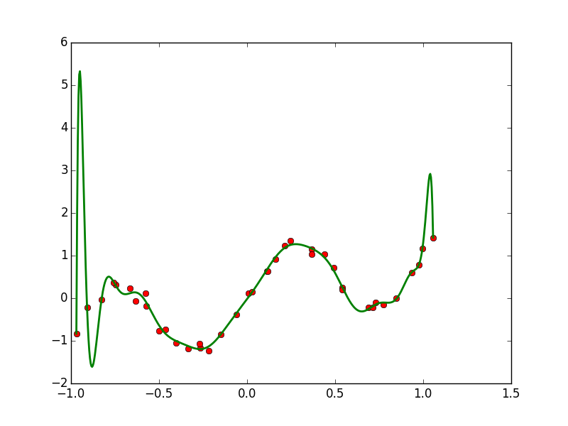

--- &twocol

## Polynomial Regression - In Sample Error

*** =left

We can generate our fit and then calculate the error on the data we've used to train:

$$ 
E = \sum_i \left ( y_i - \hat{f}(x_i) \right )^2
$$

and if we plot the results, we'll see the error monotonically going down with the degree of polynomial we use.  So should we use high-order polynomials?

*** =right

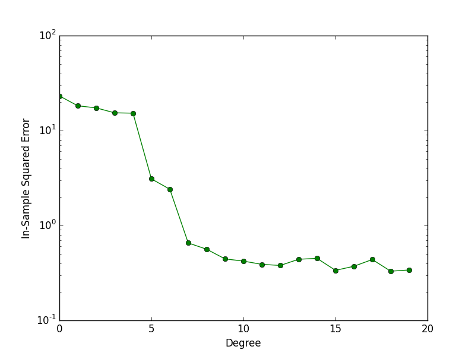

---

## Bias-Variance Decomposition

Consider the squared error we get from fitting some regression model $\hat{f}(x)$ to some given set of data $x$:

$$
\begin{eqnarray*}
E \left [ (y-\hat{y})^2 \right ] & = & E \left [ ( f + \epsilon - \hat{f})^2 \right ] \\
              & = & E \left [ \left ( f - \hat{f} \right )^2 \right ] + \sigma_\epsilon^2 \\
              & = & E \left [ \left ( (f - E[\hat{f}]) - (\hat{f} - E[\hat{f]}) \right )^2 \right ] + \sigma_\epsilon^2 \\
              & = & E \left [ \left ( f - E[\hat{f}] \right )^2 \right ]  - 2 E \left [ ( f - E[\hat{f}]) (\hat{f} - E[\hat{f}]) \right ] + E \left [ \left (\hat{f} - E[\hat{f}]) \right )^2 \right ] + \sigma_\epsilon^2 \\
              & = & \left (E[f] - E[\hat{f}]) \right )^2 + E \left [ \left ( \hat{f} - E[\hat{f}] \right )^2 \right ]  + \sigma_\epsilon^2 \\
              & = & \mathrm{Bias}^2 + \mathrm{Var} + \sigma_\epsilon^2
\end{eqnarray*}
$$

---

## Bias-Variance Decomposition

$$
\mathrm{MSE} = \left (E[f] - E[\hat{f}]) \right )^2 + E \left [ \left ( \hat{f} - E[\hat{f}] \right )^2 \right ]  + \sigma_\epsilon^2  = \mathrm{Bias}^2 + \mathrm{Var} + \sigma_\epsilon^2
$$

* Last term: intrinisic noise in the problem.  Can't do anything about it; we won't consider it any further right now.
* First term: **bias** squared of our estimate.
    * Is the expectation value of our regression estimate $\hat{f}$, the expectation value of $f$?
* Second term: **variance** of our estimate.
    * How robust/variable is our regression estimate, $\hat{f}$?

* Obvious: mean squared error has contribution from both of these terms.
* Less obvious: there is almost always a tradeoff between bias and variance.

--- &twocol

## Bias, Variance in Polynomial Fitting

*** =left

Because this is synthetic data, we can examine bias and variance in our regression estimates:

* Generate many sets of data from the model
* For each one,
    * Generate fit with given degree
    * Plot fit for visualization
    * Generate predictions at a given point (say, $x=0$)
* Examine bias, variance of predictions around zero.


*** =right

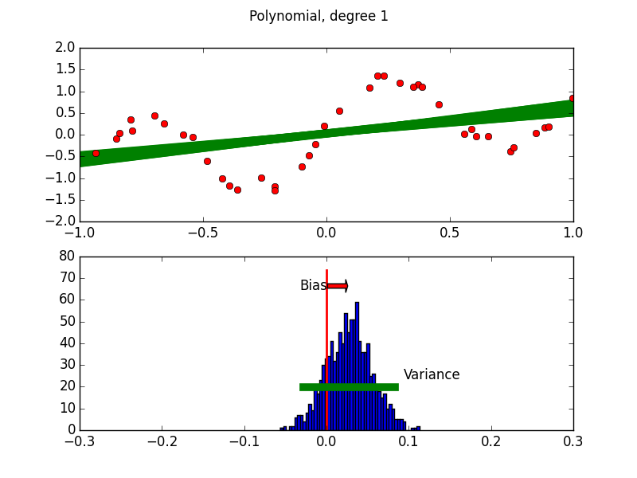

---

## Polynomial Fitting - Constant

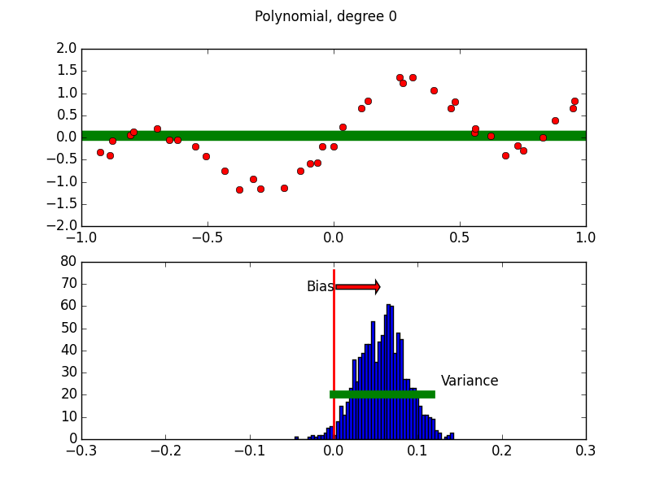

---

## Polynomial Fitting - Linear


---

## Polynomial Fitting - Seventh Order

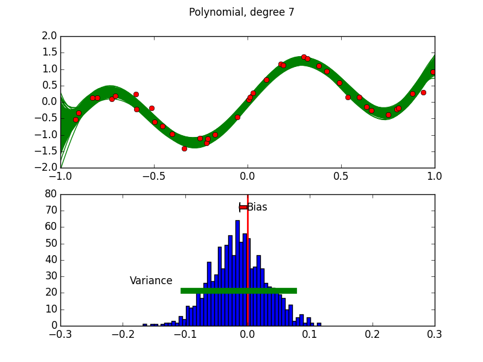

---

## Polynomial Fitting - Tenth Order

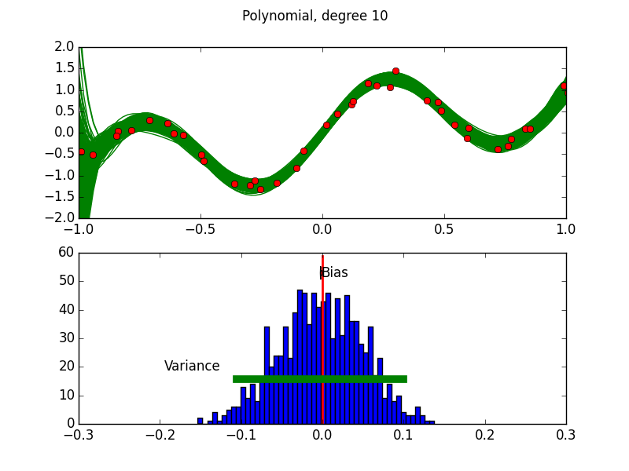

---

## Polynomial Fitting - Twentyth Order

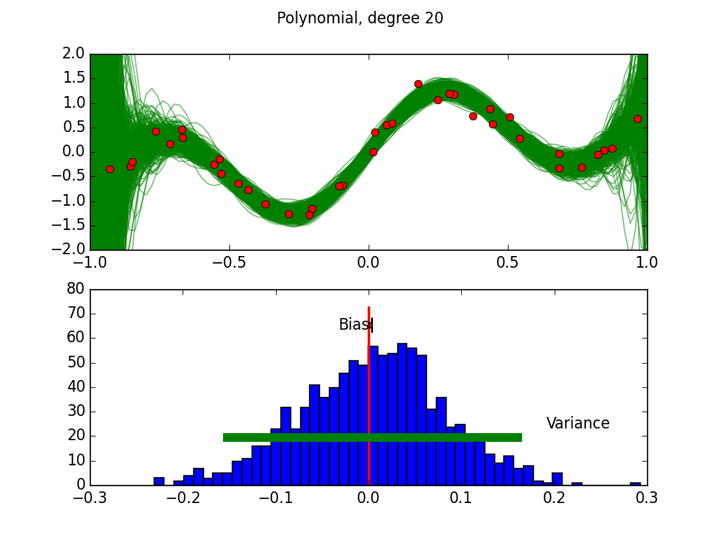

---

## Bias and Consistency

Bias is a measure of how consistent the model is with the true behaviour.

Very generally, models that are too simple can't capture all of the
behaviour of the system, and so estimators based on these simple models
have higher bias.

As the complexity of model increases, bias tends to go down; the model
can capture whatever behaviour is seen.

---

## Variance and Generalization

Variance is a measure of how sensitive the estimated model is to the particular
set of data it sees.

It is very closely tied to the idea of **generalization**.  Is the model learning
trends that will generalize to a new set of data?  Or is it just overfitting the 
noise of this particular data set?

As the complexity of a model increases, it tends to have higher variance; simple
models typically have very low variance.

Note too that variance typically gets smaller as sample sizes increase; a model
which shows large variance with different 100-point data sets will likely be
much better behaved on 1,000,000-point data sets.

--- &twocol

## Bias-Variance Tradeoff

*** =left

For our polynomial example, if we compare the error in the computed
model with the "true" model (not generally available to us!), we can
plot the error vs the degree of the polynomial:

* For small degrees, the dominant term is bias; simpler models can't capture the true behaviour of the system.

* For larger degrees, the dominant term is variance; more complex models are generalizing poorly and overfitting noise.

There's some sweet spot where the two effects are comparably low.

*** =right

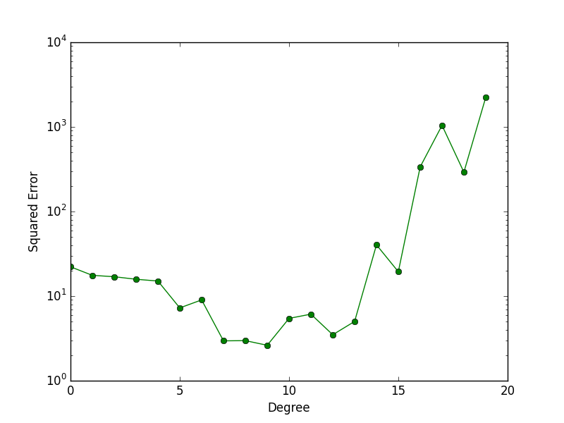

---

## Choosing the Right Model

(Or in this case, the "metaparameters" of the model)

In general, we get some dataset - we can't generate more data on a
whim, and we certainly can't just compare to the true model.

So what do we do to choose our model?  If we simply fit with higher
order polynomials and calculate the error on the same data set,
we'll find that more complex models are always "better".

How do we do out-of-sample testing when we only have one set of samples?

---

## Training vs Validation 

The solution is to hold out some of the data.  The bulk of the data is used for training 
the model; the remainder is used for validating the trained model against "new" data. 

Once the model is chosen, then you train the selected model on the entire training+validiation
data set.

In some cases, you may need still further data; eg, you may need to both choose your
model, and end a paper or report with a sentence like "the final model achieved 80% accuracy...".
This still can't be done on the data the model was trained on (train+validation); in that case,
a second chunk of data must be held out, for testing. 

In the case of Training:Validation:Testing, a common breakdown of the data sizes might be 
50%:25%:25% of the initial set.  If you don't need a test data set, 2/3:1/3 is common.

Note that the data sets should be chosen randomly!

---

## Training and Validation Hold Out Data

Once a model has "touched" a hold-out data set, it's done.

If you iterate on models or model selection having touched all the
data, you're doing exactly the same thing as fitting a 50th-order
polynomial to 52 data points and saying "See? Hardly any error!"

* Once a model (family of models) has seen the validation data set, it's done; can't tune it any more.
    * Otherwise, risk eternal torment, gnashing of teeth, etc.
* Once a set of models (set of family of models) have been compared to on the test data set, they're done; no more model selection.
    * Eternal torment, gnashing of teeth, etc.

---

## Hands-On: Model Selection 

Use this validation-hold-out approach to generate a noisy data set, and choose a degree polynomial to fit the 
entire data set.  The routines `numpy.random.shuffle()` and `numpy.array_split()` may be helpful.


```python
import scripts.regression.biasvariance as bv
x,y = bv.noisyData(npts=100)

import numpy
import numpy.random

a = numpy.arange(10)
numpy.random.shuffle(a)
print a
print numpy.array_split(a, 2)
```

```
## [6 0 4 5 8 9 1 2 7 3]
## [array([6, 0, 4, 5, 8]), array([9, 1, 2, 7, 3])]
```

---

## $k$-fold Cross Validation

There are some downsides to the approach we've taken for validation hold-out.  What if most negative outliers happened to be in the training set?

Ideally, would do several partitions, average over results.

$k$-fold Cross Validation:

* Partition data set (randomly) into $k$ sets.
* For each set:
    * Train on the remaining $k-1$ sets
    * Validate on the held-out set
* Average results

Makes very efficient use of the data set, easily automated.

--- 

##  $k$-fold Cross Validation 

How to choose $k$?

* $k$ too large - the different training sets are very highly correlated (almost all of their points are the same).
* $k$ too small - don't get very much advantage of averaging.

In practice, 10 is a very commonly-used value for $k$.

--- 

##  $k$-fold Cross Validation 

Let's look at `scripts/regression/crossvalidation.py`:

```python
    err = 0.
    for i in range(kfolds):
        startv = n*i/kfolds; endv = n*(i+1)/kfolds
        test[idxes[startv:endv]] = True

        test_x  = x[test];  test_y  = y[test]
        train_x = x[-test]; train_y = y[-test]

        p = numpy.polyfit(train_x, train_y, d)
        fitf = numpy.poly1d(p)

        err = err + sum((test_y - fitf(test_x))**2)
        test[:] = False
```

--- &twocol

## $k$-fold Cross Validation

*** =left
Running gives:

```python
from scripts.regression import crossvalidation 

crossvalidation.chooseDegree(50)
```

This chooses the degree to fit 50 data points using
cross validation, and tests the results on a new 50 points.

The error is estimated for each degree, and the minimum is chosen.
In practice, may not want to greedily go for the minimum; the
simplest model that is "close enough" to the minimum is generally
a good choice.


*** =right

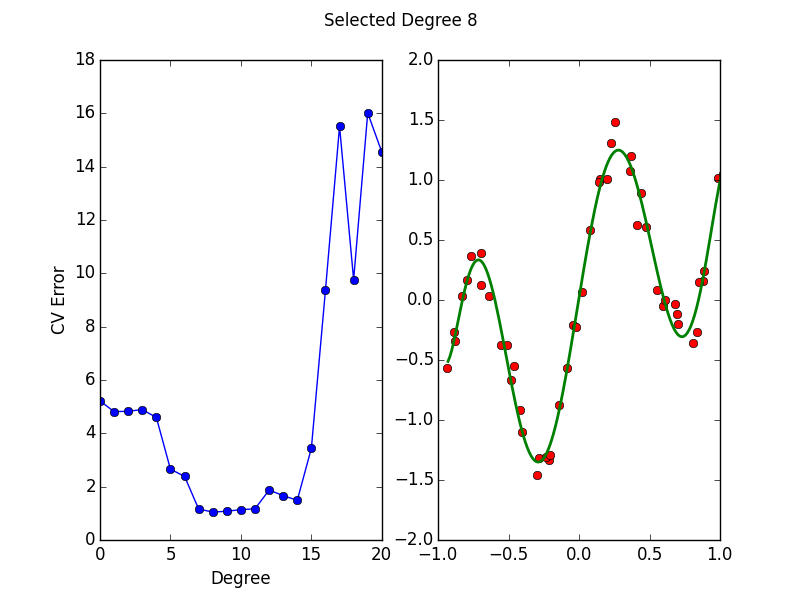

---

## Resampling Aside #1 
### Bootstrapping

Cross-validation is closely related to a more fundamental method, bootstrapping. 

Let's say you want to find how some function of your data would behave - say, the range of sample means of your data, or
a mean and standard deviation of an estimation error for a given model (as with CV).

You'd like new sets of data that you could calculate your statistic on, and then look at the distribution of those.

---

## Parametric Bootstrapping

If you _know_ the form of the distribution that describes your data, you can simulate new data sets:

* Fit the distribution to the data;
* Generate synthetic data sets from the now-known distribution to your heart's content;
* Calculate the statistic on these synthetic data sets, and get their distribution.

This works perfectly well if you know a model that will correctly describe your data; and indeed if you do know that, 
it would be madness *not* to make use of it in your analysis.

But what if you don't?

---

## Non-parametric Bootstrapping

The key insight to the non-parametric bootstrap is that you already have an unbiased description of the process that generated your data - the data itself.

The apprach for the non-parametric bootstrap is:

* Generate synthetic data sets from the original by resampling;
* Calculate the statistic on these synthetic data sets, and get their distribution.

This is less powerful than parametric bootstrapping **if** the parametric functional form is correctly known; but it is much better if the parametric
functional form is incorrectly known, or not known at all.

Cross-validation is a particular case: CV takes $k$ (sub)samples of the original data set, applied a function (fit the data set to part, calculate error on the remainder), 
and calcluates the mean.  

Bootstrapping can be used far more generally.

---

## Non-parametric Bootstrapping

Example:

```python
import numpy
import numpy.random
numpy.random.seed(789)
data = numpy.random.randn(100)*2 + 1  # Normal with sigma=2, mu=1

print numpy.mean(data)
means = [ numpy.mean( numpy.random.choice(data,100) ) for i in xrange(1000) ]
print numpy.mean(means)
print numpy.var(means)   # expect: sigma^2/N = 4/100 = 0.04
```

```
## 1.03332758651
## 1.02269633225
## 0.0395873095222
```

--- 

## Hands On: Boostrapping Forest Fires

In the file `scripts/boostrap/forestfire.py` is a routine which will load historical data
about forest fires in northeastern Portugal, including the area burned.  You can view it
as follows:


```python
import matplotlib.pylab as plt
import scripts.bootstrap.forestfire as ff

t, h, w, r, area = ff.forestFireData(skipZeros=True)

n, bins, patches = plt.hist( area, 50, facecolor='red', normed=True, log=True )
plt.xlabel('Area burned (Hectares)')
plt.ylabel('Frequency')
plt.show()
```

--- 

## Hands On: Boostrapping Forest Fires

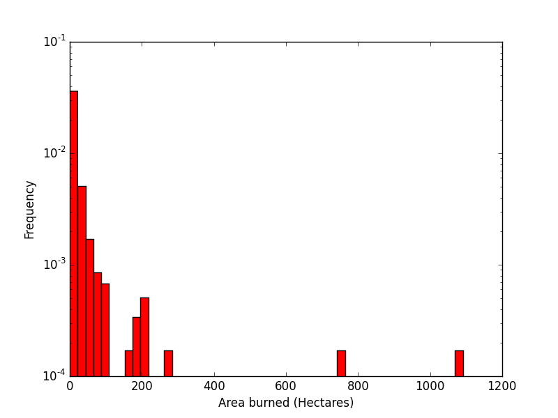

--- &twocol

## Hands On: Boostrapping Forest Fires

*** =left 
Using the non-parametric bootstrap, calculate the 5% and 95%
confidence intervals for the median of the area burned in forest
fires large enough to have their areas recorded.  Eg, you would
expect that in 90% of similar data sets, the median would fall
within those confidence intervals.

You should get a distribution of medians that look like the plot 
on the right:

*** =right

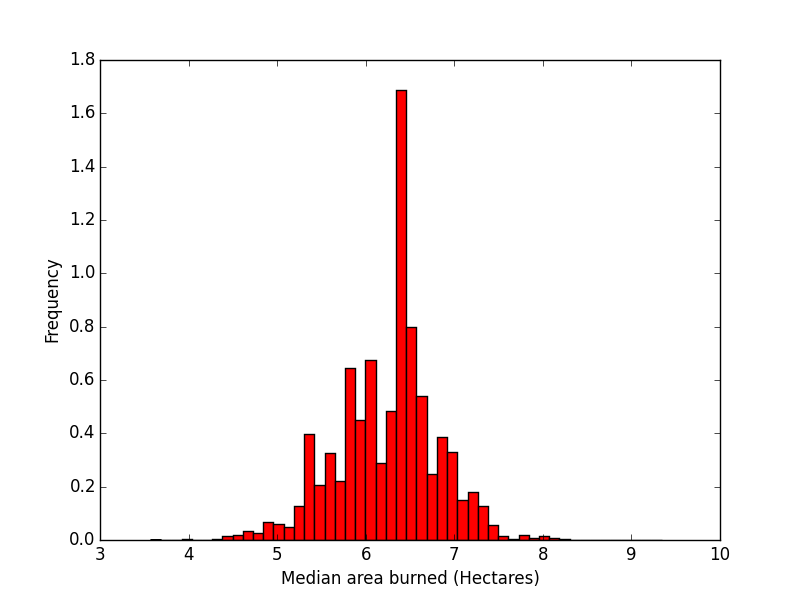


---

## Regression as Smoothing

Regression is just a form of data smoothing - smoothing the data onto a particular functional form.

For instance, consider OLS linear regression on variables we've `centred' - subtracted off the mean.

The OLS regression function is
$$
\hat{y}(x) = \frac{\sum_i x_i y_i}{\sum_j x_j^2} x
$$
We can rewrite this as
$$
\hat{y}(x) = \sum_i y_i \left ( \frac{ x_i x}{\sum_j x_j^2} \right ) = \sum_i y_i w(x,\vec{x})
$$

That is, a weighted average of *all* of the initial $y_i$s.

---

## Regression with Nonparametric Smoothing

To get good prediction results, we don't *need* to choose a particular, parameterized, global functional form to smooth onto.

As with parametric/nonparametric bootstrap,

* Parametric version is more powerful *if* the functional form is correctly known.
* Nonparametric version has to "waste" some information to reconstruct the overall shape.

Many nonparametric approaches are quite local, allowing adaptation to local features.

--- &twocol

## Nonparametric Regression - Kernel

*** =left

* The simplest approach is to smooth the value of each point over some local area with some kernel basis function.
* The regression function is then calculated by summing the input data points convolved with the basis function.
* Commonly used kernel basis functions:
    * Gaussian (downside - never falls off to zero)
    * Tricubic 
* Kernel basis function characterized by some bandwidth.
* How to choose best bandwidth?


*** =right

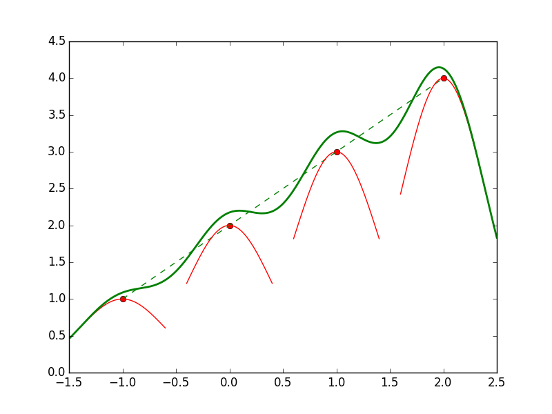
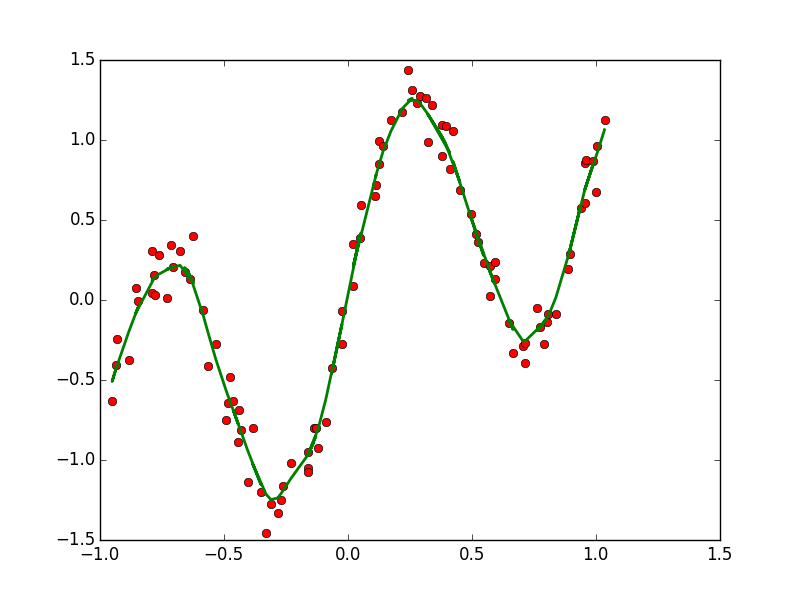

--- &twocol

## Nonparametric Regression - LOWESS

LOESS and LOWESS are two very related methods which use a similar-but-different approach to kernel regression.

*** =left

At each point, a **local** low-order polynomial regression performed, fit to some fixed **number** of neighbouring points, rather than smoothed over a particular area.

Number of neighbours has to be chosen:

* Too few: too noisy.
* Too many: smooth too much.

How are number of neighbours chosen?

*** =right

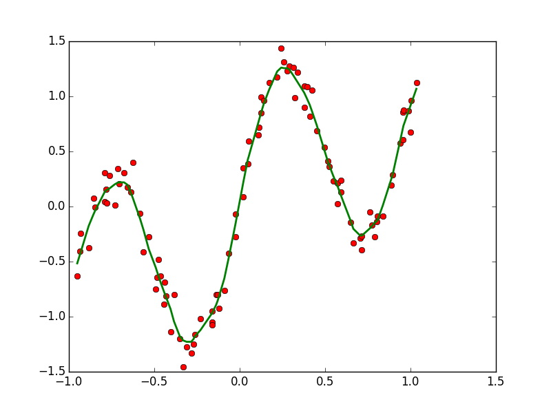

---

## `statsmodels`

Statsmodels ( http://statsmodels.sourceforge.net ) is a very useful python package which includes:

* Wide variety of regression tools
* Ties in with pandas and other packages, to give very nice environment for exploring these sorts of questions
* Many tools for hypothesis testing


```python
def lowessFit(x,y,**kwargs):
    """Use statsmodels to do a lowess fit to the given data.
       Returns the x and fitted y."""
    fit = sm.nonparametric.lowess(y,x,**kwargs)
    xlowess = fit[:,0]
    ylowess = fit[:,1]
    return xlowess, ylowess
```

---

## Nonparametric Regression

* You will sometimes hear nonparametric techniques referred to as "model-free".
    * These people are either 
        * dishonest, or 
        * too dumb to understand the techniques they're using.
    * Either way, not to be trusted.
* Have very specific models, and thus applicability:
    * Tend to require constant noise ("homoskedastic")
    * Kernel methods work best when data has roughly constant density
* However, the underlying models are both:
    * normally weaker than specifying a particular functional form
    * fairly transparent - if these methods go wrong, they don't go subtly wrong.

---

## Parametric vs Nonparametric Regression

* If you know the right answer, you should certainly exploit that
    * Will get more information out of your data.
* Nonparametric techniques will always have higher variance, bias than the right parametric method, if available
    * But it's hard for them to go subtly badly wrong.
* Even if you think you know the right answer and do a parametric regression, you should do a non-parametric regession, as well.
    * Costs almost nothing.
    * If your parametric regression is correct, non-parametric version should look like a noisier version of same.
    * If they differ substantially in some region, now you've learned something potentially quite interesting.

---

## Final Notes on Regression ... For Now

* Always consider nonparametric regression alongside any parametric regression you run.
* It should go without saying (grandmother's knee again) that, whatever regression you run, you should investigate the residuals:
    * Unbiased?
    * Randomly (normally) distributed?
    * Constant amplitude?
* Otherwise, eternal torment, gnashing of teeth, etc.

--- .segue .dark .nobackground

## Classification

---

## Classification

Classification is a broad set of problems that supperficially look a lot like regression:

* Get some data in, with known correct answers
* Learn algorithm that produces new correct answers for new inputs.

But it is greatly complicated by the fact that the labels are discrete:

* Item should either be in category A or category B.
* You don't get partial points for being close; there's no category A$\frac{1}{2}$.

So classification algorithms spend a great deal of time looking for methods to as cleanly
distinguish various categories as possible.

In some cases, it may be useful to have not only a "best guess" classification, but a quantitative
measure of how much evidence there is in that assignment.

---

## Classification Problems

Some classic classification problems:

* Bioinformatics - classify proteins according to their function
* Image processing - what objects exist in the image
* Text categorization:
    * Spam filtering
    * Sentiment analysis: is this tweet about my company positive or negative?
* Fraud detection
* Market segmentation

Input variables are commonly both continuous and categorical.

---

## Binary vs Multiclass Classification

Classification algorithms can be broken broadly into two categories;

* Binary classification: answers yes/no questions about whether an item is in a particular class;
* Multiclass classification: of $m$ classes, which one does this item belong to?

One approach to multiclass classification is to decompose into $m$ binary classification problems, and
for each item, choose the category in which the item is most securely assigned.  (This turning a discrete variable 
into a series of binary variables is called "binarization", and arises in other contexts).  

But inherently multiclass methods also exist.

---

## Outline

For the next couple of hours, we'll look at the following:

* Decision Trees
* Evaluating binary classifiers
    * Confusion matrix
    * Precision, Recall
    * ROC curves
* Nearest Neighbours
* Logistic Regression
* Naive Bayes

--- &twocol

## Decision Trees

*** =left

A Decision Tree is a structure, and the algorithm which generates
it, which classifies an input based on a number of binary decisions.

"Splits" the data set based on one of the $p$ features of the items.

Can split based on continuous data ("if height < 1.5 m"), or ordinal/discrete
("if category == 'A').


*** =right
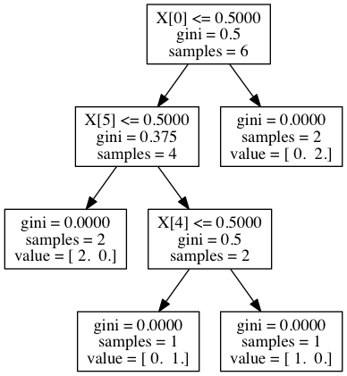

---

## Batman Decision Tree

Consider this example ( from Rob Schapire, Princeton:)

|Name    |  cape |  ears |  male |  mask | smokes | tie  | Good/Bad
|--------|-------|-------|-------|-------|--------|------|--------- 
|Batman  |  True |  True | True  | True  | False  |False | Good
|Robin   |  True | False | True  | True  | False  |False | Good
|Alfred  | False | False | True  |False  | False  | True | Good
|Pengin  | False | False | True  |False  |  True  | True | Bad
|Catwoman| False |  True | False | True  | False  |False | Bad
|Joker   | False | False | True  |False  | False  |False | Bad

"Learn" a decision tree to classify new characters into Good/Bad.

How does your tree do on this test set?

|Name    |  cape |  ears |  male |  mask | smokes | tie  | Good/Bad
|--------|-------|-------|-------|-------|--------|------|--------- 
|Batgirl |  True |  True | False | True  | False  |False | ??
|Riddler | False | False | True  | True  | False  |False | ??

---

## Splitting Algorithms

Consider the following two possible first splits:

* Split based on cape.
    * Cape == True: get Batman, Robin (Good)
    * Cape == False: get Alfred (Good), Penguin, Catwoman, Joker (Bad)
* or Split based on tie.
    * Tie == True: get Alfred (Good), Penguin (Bad)
    * Tie == False: get Batman, Robin (Good), Catwoman, Joker (Bad).

There's a sense in which cape is clearly the better split.  It leads to two groups, one of which is purely good, and the
other which is almost purely bad.

The other choice gives you two groups just as heterogeneous as the input data.

--- &twocol

## Splitting Algorithms

Typically rank possible splits based on increase in "purity" of the two subgroups it generates.

Information theory: this is clearly a more informitive decision, leads two two groups of much lower entropy.

*** =left

Consider the probability $p$ that a member of one of the subgroups is in a given category.  Two common measures 
for the "impurity" of the groups generated (higher is worse):
* Gini Index: $p (1 - p)$
* Entropy: $-p \ln p - (1-p) \ln (1 - p)$

*** =right
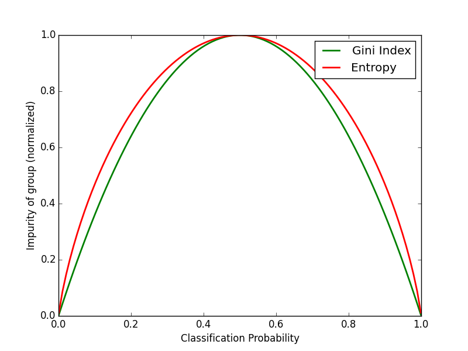

--- 

## Splitting Algorithms

So splitting algorithms look something like this:

* Until every element is in a pure subtree,
    * For each variable, consider a split.
        * For categorical, consider all levels; split and measure impurity of resulting groups.
        * For continuous, use line optimization to choose best point at which to split, keep track of impurity at that point.
    * Choose split which maximizes (negative) change in impurity

Actually implementing this leads to a large number of decisions
which effect both quality of results and computational performance.
Common, classic decision tree algorithms you will encounter include
CART and C4.5.  Both (and many others) are fine, but have their
particular strengths and weaknesses.

--- &twocol

## Scikit-learn

*** =left

Scikit-learn is a python package which contains a suite of machine
learning algorithms each of which are implemented with a consistent API.

Makes trying various algorithms on a data set fairly painless.

Typical supervised-learning workflow:

* Instantiate an instance of a particular learner (here, a classifier), with whatever parameters you choose;
* Use the `fit()` method to train it for some given input training data;
* use the `predict()` method to apply it to some test data.

*** =right

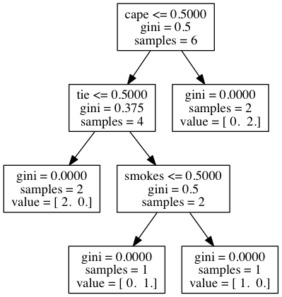

--- 

## `sklearn`

Let's take a look at `scripts/classification/decisiontree.py`:


```python
import pandas
import sklearn
import sklearn.tree

#...

    train, labels, test = goodEvilData()
    model = sklearn.tree.DecisionTreeClassifier()
    model.fit(train, labels)

    predictions = model.predict(test)
```

--- 

## `pandas`

Pandas is a python module for handling data series and R-like data frames.

Data frames are collections of columns of data about observations.
Each column may be of a different type (string, integer, float,
boolean), but within a column the data is homogeneous.

This isn't typically super-useful for regression (where we often, but not always, are
using continuous values), but is generally pretty useful for classification problems.

Many other useful features, but data frames are what interest us today.

--- 

## `pandas`

```python
import pandas

df = pandas.DataFrame( {'Name':['Jonathan','Ted','Harvey'],
                        'Type':['human','dog','roomba'],
                        'Height':[180.,50.,5.],
                        'Age':[42, 15, 2],
                        'Recharged':[False,True,True]} )
print df
```

```
##    Age  Height      Name Recharged    Type
## 0   42     180  Jonathan     False   human
## 1   15      50       Ted      True     dog
## 2    2       5    Harvey      True  roomba
```


---

## Trees and Overfitting

As with polynomials and regression, can easily produce overly-complex models which do great on their training data set
but don't generalize.

Except this is guaranteed to happen with trees.  Tree will **always** give you a completely divided up data set that will
correctly classify the input data set.   

How to avoid this?

---

## Tree-pruning

The normal approach is to let the tree do its thing, and then
afterwards prune it at some level where the results are "good enough"
while the model is not "too complex".

How to determine where that point is?  

Cross validation.

Note that after pruning, have a way to express confidence in classification - $p$ in the chosen leaf.

---

## Hands on - Iris Data Set

The iris data set is famous enough that it has its own wikipedia page: http://en.wikipedia.org/wiki/Iris_flower_data_set .

It is a set of four measurements for each of 50 irises of 3 different species.  (At least 100 of which were picked in Quebec).
It's a classic classification problem - two of the categories seperate themselves quite cleanly, but the third is much trickier.

Play with the tree parameters and see if you can improve on the sklearn defaults.


```python
import scripts.classification.decisiontree as dt

a = dt.irisProblem()
b = dt.irisProblem(splitter='random')
```

```
## Misclassifications on test set:  3 out of  51
## Misclassifications on test set:  4 out of  51
```

--- &twocol

## Nearest Neighbours - $k$NN

*** =left
Another approach to classification is very geometric in nature.

Given a new input observation, find the nearest point in the training set, and choose that classification.

A generalization is to choose the $k$ nearest neighbours, and choose the classification that the majority of those $k$ neighbouring
points has.

Case on the right: two normal distributions centred at $(-1,-1)$ and $(1,1)$ with $\sigma = 3/2$.  

*** =right
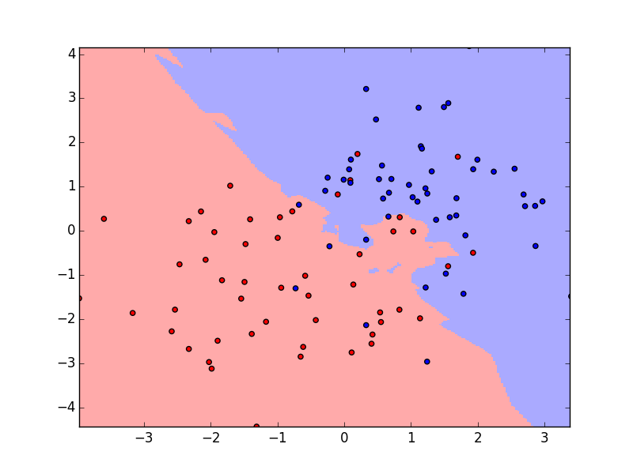

--- 

## Bias-Variance in $k$NN

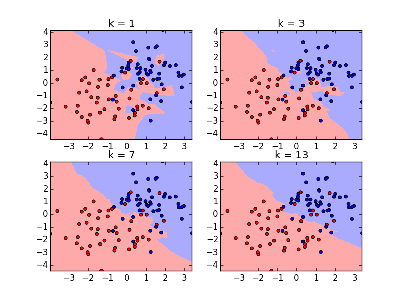

--- &twocol

## Bias-Variance in $k$NN

*** =left

There's a bias-variance-like tradeoff in $k$NN, that can be seen by varying $k$ on the same data set on our right.

In words, what's happening as we increase $k$?

With $k$ = 1, **variance** is very large.  The model is exceptionally sensitive to every single data point.
(See next slide).

But with large $k$, we average over very large area - lose local features.

*** =right


--- &twocol

## Bias-Variance in $k$NN

*** =left

Here we see the variance of the model when $k = 1$; we keep $k$ fixed at one, but have different realizations of
the data set.  

The decision boundary varies widely from run to run.

*** =right

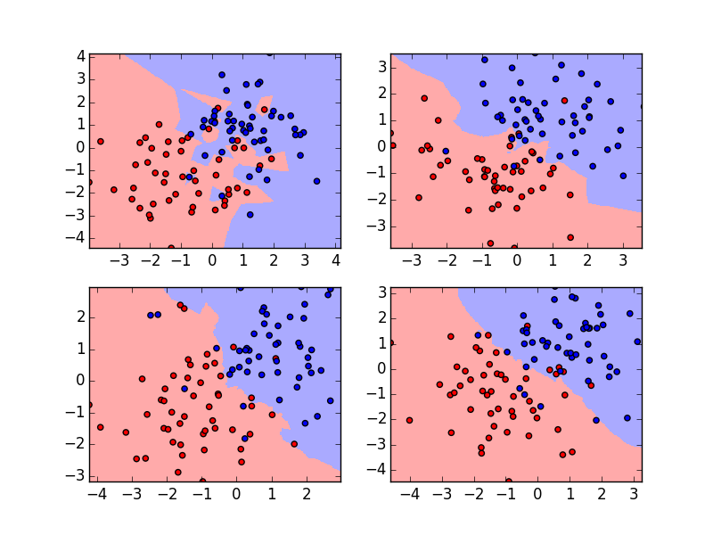

---

## $k$NN and Geometry

Some notes on $k$NN:

* This method **requires** a distance metric.  This all but rules
out categorical input variables (_some_ ordinal variables can be
made to work, but not all)
* This can work extremely well in low-dimensional spaces (small
$p$).  In 1,000-dimensional space, for instance, for any meaningful
$k$, many of your "nearest" neighbours may in fact be quite dissimilar.
* Even for a modest number of continuous variables, some caution is needed: have to *scale* the variables.

---

## $k$NN and Geometry

Consider the variables in the iris data set

```python
import sklearn.datasets
import numpy as np

iris = sklearn.datasets.load_iris()
for i in range(4):
    print iris.feature_names[i], "variance: ", np.round(np.var(iris.data[:,i]),2)
```

```
## sepal length (cm) variance:  0.68
## sepal width (cm) variance:  0.19
## petal length (cm) variance:  3.09
## petal width (cm) variance:  0.58
```

---

## Scaling continuous features

Petal length varies over a _much_ greater range than sepal width.

If we just use euclidian distance, sepal width will provide very
little information - essentially all points are close in that
dimension.

Want to scale variables so they all have the opportunity to play equal role. 
A common technique is to centre the variables by subtracting off their means, then
scale by the standard deviation:

$$ 
X' = \frac{1}{\sigma_X} \left ( X - \mu \right )
$$

Many libraries will do this for you for methods where it matters, but not all; 
check the documentation!

--- &twocol

## Digits data set

*** =left

The digits data set is a set of ~1,800 handwritten digits, ~180 of
each digit, used to train OCR systems (originally, for US zip codes).

In `sklearn.datasets.load_digits()`.

Each image is represented by 64 greylevel values (8x8 grid).

A simple $k$NN test on this data set is found in `scripts/classification/knndigits.py`.

*** =right
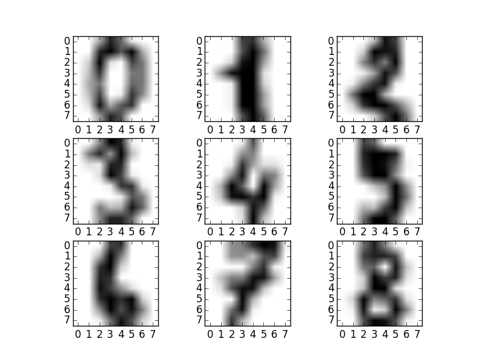

--- 

## Hands-on: kNN digits


```python
import scripts.classification.knndigits as knnd

knnd.digitsProblem(weights='distance')
```

```
## Number mismatched:  12 / 611
## [[62  0  0  0  0  0  0  0  0  0]
##  [ 0 58  0  0  0  0  0  0  0  0]
##  [ 0  0 62  1  0  0  0  0  0  0]
##  [ 0  0  0 59  0  0  0  0  0  0]
##  [ 0  0  0  0 68  0  0  0  0  0]
##  [ 0  0  0  0  0 52  0  0  0  1]
##  [ 0  0  0  0  0  0 62  0  0  0]
##  [ 0  0  0  0  0  0  0 59  0  0]
##  [ 0  4  0  1  0  0  0  0 57  0]
##  [ 0  0  0  3  0  1  0  0  1 60]]
```

--- 

## Hands-on: kNN digits

Play with the arguments to KNeighboursClassifier ( particularly
useful optins: n_neighbors, weights, algorithm ).  Can you improve
the performance?

(You may wish to pass a seed to keep the train/test set the same for each test)

You may also wish to try to use a decision tree on the same data.  Is that 
better?  Worse?  Why?

---

## Confusion matrix

How you 'score' a classifier is different than a regression.

You can count the number wrongly classified, and that is a useful
way to keep score - but it doesn't give you much information you can use to improve the result.

Confusion matrix tells you which misclassifications happened.
Traditionally, "true" classifications on the rows, model predictions
on the columns.


```python
import scripts.classification.decisiontree as dt

dt.irisProblem(printConfusion=True)
```

```
## Misclassifications on test set:  2 out of  51
## [[19  0  0]
##  [ 0 17  0]
##  [ 0  2 13]]
```

---

## Evaluating Binary Classifiers

Binary classification is a common and important enough special case
that its confusion matrix elements have special names, and various quality measures are defined.


|                    |  Classified Positive (CP)  |  Classified Negative (CN) |
|--------------------|--------------|---------------|
|  Actual Positive (P)  |  <span style="color:green; font-weight:bold">True Positive(TP)</span> | <span style="color:red; font-weight:bold">False Negative (FN)</span> | 
|  Actual Negative (N)  |  <span style="color:red; font-weight:bold">False Positive (FP)</span> | <span style="color:green; font-weight:bold">True Negative (TN)</span> |

One can always get exactly one of FN or FP zero - for instance, if
my classifier just classifies everything as positive, there will
never be a false negative, and vice versa.

But there's usually some tradeoff between false negatives and false
positives.

---

## Evaluating Binary Classifiers

Several quality measures exist, but because of the FN/FP tradeoff, you normally need two, one from each category:

* Something to do with how many of the actual positives you get
    * Sensitivity = Recall = True Postive Rate (TPR)
        * $\mathrm{TPR} = \mathrm{TP}/\mathrm{P} = \mathrm{TP}/\left(\mathrm{TP}+\mathrm{FN}\right)$.  
        * Given an actual positive, what is the probability of it being classified positive?
* Something to do with how strong evidence your positive classification is:
    * Specificity (SPC) = 1 - False Positive Rate (FPR)
        * $\mathrm{SPC} = \mathrm{TN}/\mathrm{N} = \mathrm{TN}/\left (\mathrm{FP}+\mathrm{TN}\right)$
        * Given an actual negative, what is the probability of it being classified negative?
    * Precision = Positive Predictive Value (PPV): $\mathrm{PPV} = \mathrm{TP}/\left(\mathrm{TP}+\mathrm{FP}\right)$.
        * What fraction of your positive calls are true?

--- &twocol

## ROC Curve

*** =left

In most binary classifiers, there's some equivalent of a threshold you can set; 
* Set it lower (to allow more true positives, but also false positives);
* Or higher (to allow more true negatives, but also false negatives).

Plotting one of the two quality measures on either axis, get a ROC curve.  
* Diagonal line = random chance
* Want to be as far away as possible.

sklearn plots TPR vs FPR (= 1 - SPC).

*** =right

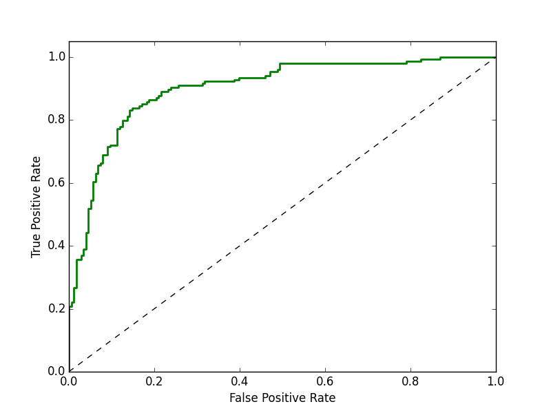

---

## ROC Curve


--- &twocol

## Evaluating Binary Classifiers

*** =left

Where to set the threshold?

* For applications where a false positive is just as bad as a false negative, try to balance the two error rates.
* But some applications, a false positive is much worse than a false negative, or vice versa.
* Correct choice is problem dependant.
*** =right


--- &twocol

## Logistic Regression

*** =left

One way to consider binary classification is to go back to regression,
and consider a linear regression to an integer 0/1 variable for classification.

Get over 0.5, True, else False.

Requires a linear seperation between the classes, but this is
somewhat less of a problem for high-$p$ problems; can often be useful.

However, naive linear regresion has a number of problems, which grow worse
at high $p$, that mostly come down to the unbounded nature of the function.

*** =right

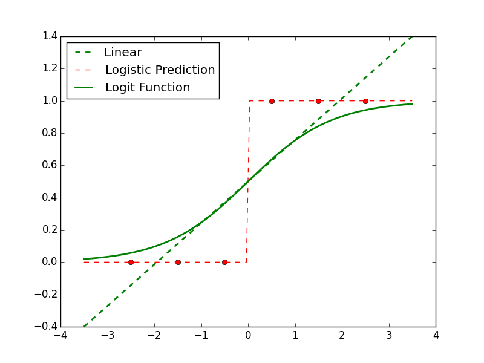

--- &twocol

## Logistic Regression

*** =left

However, a surprisingly minor variation on this approach makes it very useful.

A whole infrastructure exists for "generalized linear models", where the function
being fit is not 
$$
y = \beta_0 + x_1 \beta_1 + x_2 \beta_2 + \dots = x \vec{\beta}
$$

but some power or exponential of $X \vec{\beta}$.

Consider fitting not $p$, but the log-odds,
$$
\mu = \ln \frac{p}{1-p} = \beta_0 + \beta_1 x_1
$$
so now $p$ can remain between 0 and 1, and the linear function can remain unbounded.

*** =right


--- &twocol

## Logistic Regression

*** =left

We can fit this log-odds equation, and derive
$$
p = \frac{e^{\beta_0 + x \beta_1}}{1 + e^{\beta_0 + x \beta_1}} = \frac{1}{1 - e^{-(\beta_0 + x \beta_1)}}
$$

This approach has a number of very nice properties:

* We have a nice, bounded, well-behaved function and transformation to fit
* We can directly calculate the inferred probability of membership.  
* We're essentially fitting a Bernoulli process.

*** =right


--- &twocol

## Logistic Regression

*** =left

One has to use somewhat different numerical algorithms to fit these
curves; typical curve-fitting algorithms deal very poorly with
exponentials.

Often use techinques like expectation maximization (EM) or other
well-conditioned iterative methods.  

That's fine; they're all hidden beneath whatever logistic or GLM 
packages you might want to use.


*** =right


--- &twocol

## Logistic Regression

*** =left

Logistic regression can be fairly easily used in multiclassification problems; we have the probabilities in the binary case, so
we can apply $c$ classification tests and take the best one.

Note the linear class boundaries.  The results aren't as bad as they look here, as we're projecting out two dimensions.

*** =right
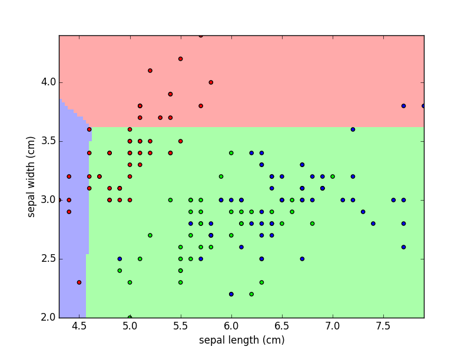

--- 

## Logistic Regression Hands on


```python
import scripts.classification.logisticiris as logir
import numpy.random

numpy.random.seed(123)
logir.irisProblem(printConfusion=True)
```

```
## Misclassifications on test set:  6 out of  51
## [[12  0  0]
##  [ 0 16  6]
##  [ 0  0 17]]
```

Because of the additional dimensions in the problem, logistic
regression actually does quite well on this problem.  Can you tweak
it to work still better?  Useful parameters to play with are the
penalty parameter (using L1 or L2 distances), a regularization parameter
C, a tolerance (when to stop iterating).

---

## Naive Bayes

Naive Bayes might be better called "Naive Application of Conditional Probability", but you can see where
that might not have caught on.

A classifier that calculates an assignment probability given data $\vec{x}$ calculates, implicitly or explicitly, a probability
$$
P(C=c | \vec{x}) = P(C=c | x_1, x_2, \cdots, x_p )
$$

By Bayes's Theorem (conditional probability), this is

$$
\mathrm{P}(C=c | x_1, x_2, \cdots, x_p ) = \frac{\mathrm{P}(C=c) \mathrm{P}(x_1, x_2, \cdots, x_p | C=c)}{\mathrm{P}(x_1, x_2, \cdots, x_n)}
$$

The bottom is just a normalization we're not interested in, so we consider
$$
\mathrm{P}(C=c | x_1, x_2, \cdots, x_p ) \propto \mathrm{P}(C=c) \mathrm{P}(x_1, x_2, \cdots, x_p | C=c)
$$


---

## Naive Indeed

$$
\mathrm{P}(C=c | x_1, x_2, \cdots, x_p ) \propto \mathrm{P}(C=c) \mathrm{P}(x_1, x_2, \cdots, x_p | C=c)
$$

Here's where the "Naive" comes in.  We're going to assume that the different features of the data are *independent*
of each other, conditional on $C=c$.  Madness!  But, recklessly tossing caution to the wind,

$$
\mathrm{P}(C=c | x_1, x_2, \cdots, x_p ) \propto \mathrm{P}(C=c) \prod_{i=1}^p \mathrm{P}(x_i | C=c)
$$

By making the decision to completely ignore the correlations between features, this method is blissfully unaware
of the primary difficulty of high-dimensional (high-$p$) datasets, and training Naive Bayes classifiers becomes extremely easy.

---

## Training Naive Bayes

Looking back at the Batman data set:

|Name    |  cape |  ears |  male |  mask | smokes | tie  | Good/Bad
|--------|-------|-------|-------|-------|--------|------|--------- 
|Batman  |  True |  True | True  | True  | False  |False | Good
|Robin   |  True | False | True  | True  | False  |False | Good
|Alfred  | False | False | True  |False  | False  | True | Good
|Pengin  | False | False | True  |False  |  True  | True | Bad
|Catwoman| False |  True | False | True  | False  |False | Bad
|Joker   | False | False | True  |False  | False  |False | Bad


* $\mathrm{P}(C=\mathrm{Good}) = 1/2$; $\mathrm{P}(C=\mathrm{Bad}) = 1/2$; 
* $\mathrm{P}(\mathrm{cape} | C=\mathrm{Good}) = 2/3$
* $\mathrm{P}(\mathrm{ears} | C=\mathrm{Good}) = 1/3$
* $\mathrm{P}(\mathrm{smokes} | C=\mathrm{Good}) = 0$

etc.

---

## Training Naive Bayes

In fact, what one would actually do is, rather than assume constants, is fit a distribution to the various conditional probabilities.
* Continuous: Gaussian (typically)
* True/False: Bernoulli
* Integer: Binomial/Multinomial

But the basic training method is the same, and crucially, is done on each dimension independently.

Fast, requires quite modest amounts of data even in very high dimensional spaces.

---

## Naive Like a Fox

In fact, Naive Bayes can do quite well in problems where there are so many variables that the correlations between random
pairs of them are quite small.

A classic example is text processing, in which sometimes documents are treated as "bags of words":

* "twas brillig and the slithy toves did gyre and gimble in the wabe".
* { and:2, brillig:1, did:1, gimble:1, gyre:1, in:1, slithy:1, the:2, tove:1, twas:1, wabe:1 }

Obviously, this throws away a great deal of semantically important information, but works quite well for broad-brush applications
like sentiment analysis, topic analysis, or spam filtering.

Individual word choices _are_ most definitely correlated, but not incredibly strongly.  There are a lot of possible words out there.

---

## Usenet Newsgroups Classification

Usenet newsgroups were basically prehistoric Reddit, back in the
day.

Posts occurred in various topic forums, and the "20 newsgroups
dataset" ( http://qwone.com/~jason/20Newsgroups/ ) is a set of
~20,000 posts across these groups.  The question is one of
classification: could you correctly place a post in the right
newsgroup?

Very similar to any of a number of other text classification problems.

Scikit-Learn has a routine for loading this data set, and breaking
it into bags of words (and further processing, such as stripping
out relatively meaning-free English "stop words" that would otherwise 
flood the statistics: the, an, one, and, but, etc.)

---

## Usenet Newsgroups Classification


```python
import scripts.classification.text as txt

categories = ['comp.os.ms-windows.misc', 'misc.forsale', 'rec.motorcycles', 'talk.religion.misc']
txt.newsgroupsProblem(categories, printConfusion=True)
```

```
## f1-score:  0.877293802813
## [[323  23  31  17]
##  [ 12 347  25   6]
##  [  3  13 370  12]
##  [  5   4  25 217]]
```

---

## Text Processing Hands On

Using `scripts/classification/text.py` as a startingpoint, play further with Naive Bayes (does BernoulliNB - just treating
the words as present/not present instead of counts - make a difference?).  Do the other classifiers work better?

Or: how does Naive Bayes deal with the Iris data set (using GaussianNB?)

---

## Classification Summary

We've covered quite a bit of ground here:
* Probabilistic methods (Naive, maybe Logistic Regression)
* Regression method (LR)
* Tree-based method (decision tree)
* Geometric method (kNN)

They each have benefits and drawbacks.  Decision Trees and LR both,
in their way, require one or a series of linear separation surfaces;
kNN requires a meaningful distance metric.  Decision Trees and
especially NB can work quite well in high-dimensional spaces.

There are guidelines you can use, but ultimately experience and
experimentation is most important.

--- .dark .segue .nobackground

## Variable Selection

---

## Multivariate Linear Regression

Let's take a look at linear regression again, using statsmodels and a wider data set:


```python
import statsmodels.api as sm

data = sm.datasets.star98.load()
X = data.exog; Y = data.endog
X = sm.add_constant(X)
model=sm.OLS(Y[:,0],X)
results = model.fit()
print results.summary()
```


---

## Multivariate Linear Regression


```python
##Model:                            OLS   Adj. R-squared:                  0.507
##[...]
##Time:                        13:01:10   Log-Likelihood:                -2279.5
##No. Observations:                 303   AIC:                             4601.
##Df Residuals:                     282   BIC:                             4679.
##[...]
##==============================================================================
##                 coef    std err          t      P>|t|      [95.0% Conf. Int.]
##------------------------------------------------------------------------------
##const      -1.014e+04   5209.878     -1.946      0.053     -2.04e+04   115.090
##x1             0.2139      2.230      0.096      0.924        -4.175     4.603
##x2            15.3423      3.505      4.377      0.000         8.443    22.242
##x3             5.9944      4.140      1.448      0.149        -2.155    14.144
##x4            -3.0512      2.138     -1.427      0.155        -7.261     1.158
##x5          1597.6665    155.557     10.271      0.000      1291.467  1903.866
##x6          1176.8157    249.155      4.723      0.000       686.377  1667.255
```


---

## Multivariate Linear Regression


```python
##x7           340.5269     62.086      5.485      0.000       218.317   462.737
##x8         -1714.4834    904.058     -1.896      0.059     -3494.042    65.075
##x9          -405.7498    195.183     -2.079      0.039      -789.951   -21.549
##x10         -228.3569     99.588     -2.293      0.023      -424.388   -32.326
##x11            7.1600      4.862      1.473      0.142        -2.411    16.731
##x12            0.4313      1.333      0.324      0.747        -2.193     3.056
##x13         -109.8054     10.718    -10.245      0.000      -130.903   -88.708
##x14          -28.1694      2.587    -10.888      0.000       -33.262   -23.077
##x15          -21.4271      4.318     -4.963      0.000       -29.926   -12.928
##x16           84.6002     43.967      1.924      0.055        -1.945   171.146
##x17           47.8686     20.668      2.316      0.021         7.185    88.552
##x18           11.9591      4.679      2.556      0.011         2.750    21.168
##x19            1.9302      0.175     11.049      0.000         1.586     2.274
##x20           -2.5449      1.018     -2.499      0.013        -4.549    -0.540
```

---

## Multivariate Linear Regression

What to make of all of this?

* Can compute a linear regression with all available variables.
* Is this meaningful?
* Naively, it looks like some of these variables aren't very important.
* Can construct a better-motivated, more robust model if we reduce the number of variables / features.
* Some regression/clustering/classification algorithms will have real difficulties on problems with many extraneous variables.
* Sometimes variables are highly collinear and will break some algorithms.
* The information "only these 5 (say) variables are really important" is itself worth having.

We should strive to produce the simplest model that produces sufficiently good answers.
* Feature selection.

---

## How Not to do Variable Selection

"Variables 3,5,6,13,14,15, and 19 all have really low $p$ values - let's just use those."
* No.

A super-low $p$-value means, "in _this_ _model_, it's unlikely that this coefficient is zero".
* Says nothing about its contribution to the hypothetical model in which you've removed other variables.
* Says even less about how _important_ the contribution of the variable is.

---

## How to do a Little Variable Selection

There are some filtering steps one can judiciously take to weed out some clearly irrelevant variables:

* Low variance filtering (`sklearn.feature_selection.VarianceThreshold`).
If the variable is essentially constant, it can't matter much to any model.
* Univariate tests (`sklearn.feature_selection.SelectKBest`): for
supervised learning, **if** your data is sampled densely enough,
can do univariate tests on each parameter and remove ones that are sufficiently uncorrelated with label.


---

## How (Maybe, but Hopefully Not) to do Variable Selection

How have we done model selection in the past?
* Cross-validation!

Huge CV problem:
* Try all $2^p$ combinations of variables.
* Regress on them.
* Of the possibilities, find best (adjusted) error.
* Will work for modest $p$.
* (But for modest $p$, don't need so badly to do variable selection.)

---

## Aside: Danger, Danger!
### Multiple Hypothesis Testing

In general, something inside you should shudder when facing the possibility of doing tens of thousands of tests on your data.

For variable selection, this is ok, but for very small perturbations
of this problem description things quickly go horribly, inexorably,
off the rails.
* "Let's look through all pairwise combinations of my 100 features, looking for statistically significant correlations!"
* This comes up in cases where it's not necessarily obvious - looking for correlations between pixels in images.
* If you are doing 10,000 hypothesis tests, using as your test for significance $p < 0.05$, you **expect** 500 significant results --- even if the data is just random noise.
* Eternal torment, gnashing of teeth, etc.

---

## Aside: Danger, Danger!
### Multiple Hypothesis Testing

The canonical cautionary works on this subject:
* http://xkcd.com/882/ (deals with the subject in XKCDs inimitable fashion)
* http://www.wired.com/2009/09/fmrisalmon/ (finds statistically significant activation correlations in the brain of a salmon shown pictures of humans experiencing emotions.  The salmon "was not alive at the time of scanning").

---

## Multiple Hypothesis Testing Corrections

There are a few methods of dealing with the situation of multiple
testing.  They all involve stricter definitions of what is significant
in this situation.  

Which is appropriate depends on the nature of your tests. Are they all independent? Identically distributed?

* **Bonferroni Correction**: Safest choice; works regardless of independence, distribution.  Bluntest instrument.
    * If you otherwise would use a threshold $\alpha$ for significance, and are doing $k$ tests, use $\alpha / k$.
* **Šidák correction**: If independent:
    * use $(1 - (1-\alpha)^{(1/k)})$.
* **Holm–Bonferroni method**: If independent, 
    * Sort results by significance, apply strictest Bonferroni correction only to most significant (i=1); in descending order, use $\alpha/(k-i+1)$.

---

## Multiple Hypothesis Testing Corrections
### End of Aside

We won't cover this any further today, but it is vitally important to know
that both this is an issue, and there are ways of correcting for it.

Terms to look up if you find yourself in this situation:
* Family wise error rate
* False discovery rate

---

## Forward and Backward Selection
### How else to do variable selection

Exhaustive search is safe, but infeasible in the most urgent cases.
($p = 100$ implies $10^{30}$ model tests, and 100 isn't a huge
number of features.)

Two greedy methods are in common use, but can get caught in local minima:

* Forward selection: starting from nothing,
    * For each remaining feature, include it, and calculate adjusted CV error.
    * If for best feature, error drops enough, select it and continue
    * Else terminate and report selected features.
* Backward selection: same, but start with a model with all features, and drop until error rises too much.
    * sklearn: `RFECV` (Recursive Feature Elimination w/ CV)

---

## AIC, BIC, etc

How do you decide if a model with an additional feature is "better" than a simpler one?
* Always expect the more complex model to fit a little better.
* Question is, is it better *enough* to justify the extra parameter?

Two Information Criterion (AIC, BIC) consider the likelihood of the model, given the data, with a penalty for the number of
parameters in the model.

$$
\mathrm{xIC} \approx -2 \log L + k \alpha
$$

where $L$ is the likelihood of the model, $k$ is the number of
parameters, and $\alpha = 2(1 + (k+1)/(n-k+1))$ for AIC and $\log
n$ for BIC.

A decrease in AIC/BIC corresponds to a better model, taking into account the models' complexity.

Correspond to different assumptions.  BIC is a little stricter,
which has advantages and disadvantages.  Either is defensible if used consistently.

---

## Variable Selection as Part of the Model

What we've described so far is treating variable selection as a
general optimization problem, with the model construction as a
separate black box.

But in many cases, variable selection can be part of the model-building
step.

Decision trees: necessarily keep track of which features are most
important for dividing up the data.  In `sklearn`, in the fitted
decision tree model, the attribute `feature_importances_` is available
for ranking the discovered importance of the dimensions.

---

## Lasso/Ridge Regression

There are *regularization* methods in regression which tamp down the coefficients of "unimportant" variables, or eliminate
them together, based on a fairly modest-looking change to how we specify the problem. 

Recall that for generic least-squares regression, we are minimizing the MSE:
$$
\mathrm{MSE} = \left ( y - X_0 \beta_0 - X_1 \beta_1 - \dots - X_p \beta_p \right )^2 = \left ( y - X \beta \right )^2
$$
resulting in
$$
\hat{\beta} = \mathrm{argmin}_\beta \left ( y - X \beta \right )^2
$$

What we'd like to do is keep the problem as simple as possible - one way of thinking of that in regression is forcing
the fit parameters to stay small; to constrain $|\beta|$ in some way.

---

## Lasso/Ridge Regression

Ridge and Lasso regression do a similar minimization, but with a penalty term for the coefficients:

Ridge:
$$
\hat{\beta} = \mathrm{argmin}_\beta \left ( y - X \beta \right )^2 + \lambda || \beta ||_2^2
$$

Lasso:
$$
\hat{\beta} = \mathrm{argmin}_\beta \left ( y - X \beta \right )^2 + \lambda || \beta ||_1
$$

In scikit-learn, these are available through `sklearn.linear_model.Lasso` and `.Ridge`.

---

## Lasso/Ridge Regression

Both of these methods incur a penalty - the resulting regressions have a bias, as what we are optimizing for
is no longer solely to zero out mean squared error.

The reason to use Lasso/Ridge is when we are explicitly willing to trade some bias for more variance, and to 
simplify a model.  For the smoother penalty of ridge, this tradeoff can be written down explicitly for Ridge;
can only be numerically calculated for Lasso.

Because of the smoother penalty term in Ridge, cannot zero out variables $\beta_i = 0$; thus it simplifies the model
in some sense, but doesn't properly do variable selection.  Lasso, however, will zero out coefficients.

--- &twocol

## Lasso Regression

*** =left

In either case, with Lasso or Ridge, coefficients decrease (usually smoothly) with increase in the regularization
parameter (in Lasso, $\alpha$).  

Ridge coefficients can pass through zero and change sign; not with Lasso.

An example can be seen in `scripts/regression/lasso.py`

*** =right

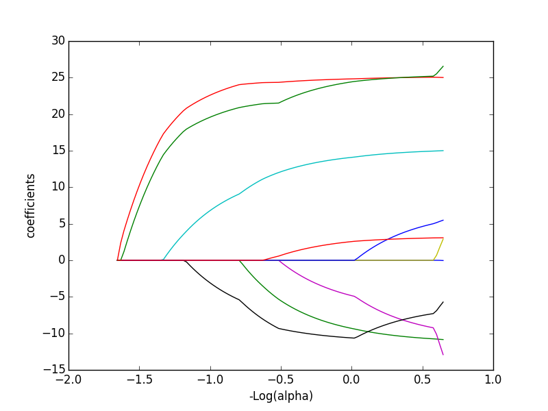

--- 

## Lasso Regression

Bias-Variance tradeoff; as we slowly bring down $\alpha$, bias increases, but for quite a while it's more than balanced by
reduction in variance:


```python
import scripts.regression.lasso as lasso
import numpy

X,y = lasso.getDiabetesData()
alphas = numpy.logspace(0.5,-3.5,20)
mses=[]
for alpha in alphas:
    mses.append(lasso.lassoFit(X,y,alpha=alpha))
print numpy.round(mses,2)
```

```
## [ 3167.42  2979.89  3118.9   3000.94  3095.79  3427.5   3022.48  3152.64
##   3289.54  2907.83  2935.09  3105.    3138.35  3056.27  3230.43  3203.78
##   3316.99  3184.72  3030.19  3237.38]
```

---

## PCA

Properly speaking, PCA isn't variable selection - it's a technique
that allows dimension reduction in problems with purely continuous variables.

Doesn't look at the labels of the data; just imagines the data as points
in a $p$-dimensional space.

PCA is a transformation which rotates and scales the space into directions
defined by the variance in the data.  The direction in which the variance is 
highest is rotated to point along the first axes (the first principal component).
Next along the second axis, etc.

Increasingly higher dimensions are flatter and flatter, as they have less
variance.  The least significant principal components can often be profitably
ignored, as there is very little variation in those directions.


--- &twocol

## PCA

*** =left

Note that PCA doesn't drop variables; rather, it generates combinations of all variables
in order of how significantly they vary.

One generally keeps most of the information from all variables, but expressed in a number
of combinations $k$ < $p$.  Potentially best of both worlds - model simplicity without
throwing away information.

*** =right

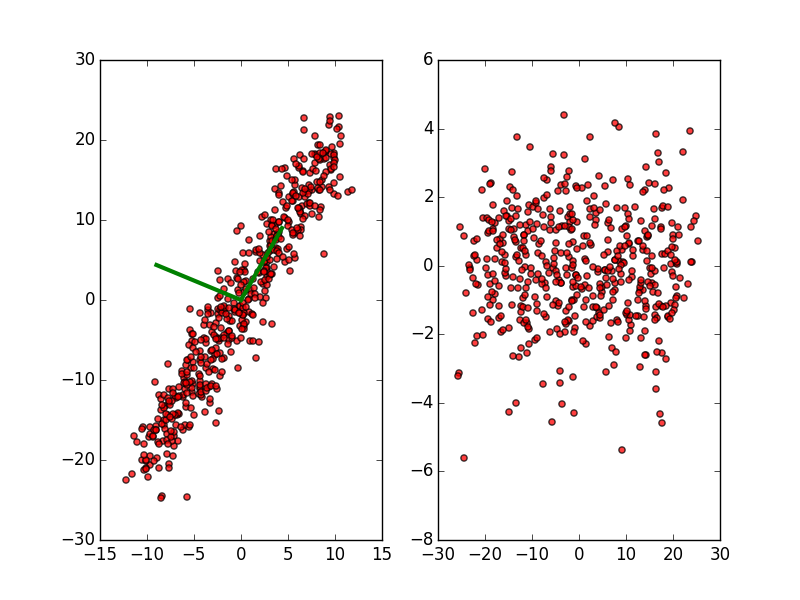

---

## Variable Selection Hands-On

Take star98 demo from the beginning of this section, or the diabetes dataset from the lasso 
example, and play with lasso and ridge regression, or use a decision tree on the data and
examine important variables via the tree.  

Which variables are the most important?  Least?

--- .dark .segue .nobackground

## Clustering 

--- 

## Clustering Overview

--- 

## K-means

Foo bar baz

---

## Hierarchical Clustering

--- .dark .segue .nobackground

## Ensemble Methods

--- 

## Bagging, Boosting

--- 

## Random Forest

--- .segue .dark .nobackground

## Conclusions

---

## Concluding Points

---

## Useful Resources

* Cosma Shalizi, "Advanced Data Analysis from an Elementary Point of View", http://www.stat.cmu.edu/~cshalizi/ADAfaEPoV/, covers regression, hypothesis testing, PCA, and density estimation, amongst other things, and is extremely lucidly written.
* Andrew Ng, CS229 ML course, http://cs229.stanford.edu/materials.html, and associated Coursera MOOC
* Jure Leskovec, Anand Rajaraman, and Jeff Ullman, Mining of Massive Data Sets, pdf book online, http://www.mmds.org
* Mohammed J. Zaki and Wagner Meira Jr., Data Mining and Analysis: Fundamental Concepts and Algorithms, http://www.cs.rpi.edu/~zaki/PaperDir/DMABOOK.pdf
* Scikit-Learn tutorial, http://scikit-learn.org/stable/tutorial/
* Your SciNet Team
* + many others.  
